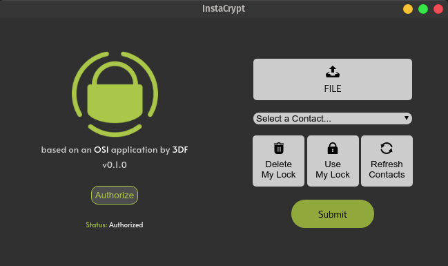

# 3DF InstaCrypt v0.2.0
**maintained by:** @hkdb <br />


## Description
---
A [go-astilectron](https://github.com/asticode/go-astilectron) Cross-Platform Graphical Desktop Application (GUI wrapper) written in Go, Javascript, and HTML5 that simplifies encrypting and decrypting files with the [InstaCrypt](https://instacrypt.io) service and [ssh-vault](https://ssh-vault.com).

It aims to provide a way for non-technical users to be able to easily adopt encryption technology for sending sensitive files. It removes the need of the users having to manage keys or passwords and renames the private and public key pair as the "key" and the "lock" respectively. The idea is that you use a lock to lock the files up and use a key to unlock it. Each user gets a unique lock and key (ssh key pair) generated with the app seamlessly and the lock (public key) gets uploaded to the InstaCrypt service so that it can be pulled by other users that are authorized contacts of the user. In the UI, the contacts drop down menu will have all of the user's authorized contacts to choose from. From there, the user can choose to encrypt a file for any of his/her contacts which only that destination contact can unlock (decrypt). The InstaCrypt service does not store anything besides the user's email, hashed password, the list of authorized contacts(and active contact requests) and his/her public key. This architecture allows for all encryption to happen locally without depending on a cloud service to do the encryption for you. Of course, the system is deemed to be safe only under the assumption that each client computer has full encryption on their harddrive and that the client computer is not compromised. Users should also backup their lock and key as there's no other copy anywhere else besides the device they generate the pair with.

The InstaCrypt service is developed and run by [3DF Limited](https://3df.io). For more information, visit https://instacrypt.io

## Change Log
---

You can also follow our twitter to track announcements of releases of this project as well as other 3DF OSI projects and news: https://twitter.com/3dfosi

- December 24, 2020  - Refined installer for Windows
- December 18, 2020  - Added installer for Windows
- November 30, 2020  - Changed default wHeight to 400 and bumped to 0.2.0
- November 29, 2020  - WIP: Added guided setup, added auto get contact list to verify authorization, and CSS tweaks
- November 22, 2020  - WIP: Increased size of authorize button and removed encrypt/decrypt and key button
- October 19, 2020   - Mac dirty compile hack fix 
- October 19, 2020   - Dirty hack for handle compiling across platforms
- October 19, 2020   - Windows fixes
- October 13, 2020   - completed first test & fixed decrypt key check
- October 13, 2020   - first commit

## Screenshots
---


## Build & Dist
---

First time:
```
go get -u github.com/asticode/go-astilectron-bundler/...
```

To Build:
```
./build.sh
```
To Run:
```
./run.sh
```

## Disclaimer
---
In no way do the maintainers make any guarantees. Please use at your own risk!

## Recognition
---
Shout out to the people at [ssh-vault](https://github.com/ssh-vault) for making an awesome way to handle secure sharing [asticode](https://github.com/asticode) for creating [go-astilectron](https://github.com/asticode/go-astilectron) to spare me of having to use JS for backend too.

This is an application utility built on top of an [open source app](https://github.com/hkdb/sshshare) sponsored by 3DF Limited's Open Source Initiative.

To Learn more please visit:

https://osi.3df.io

https://3df.io
